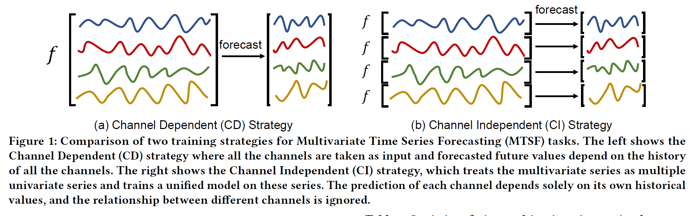
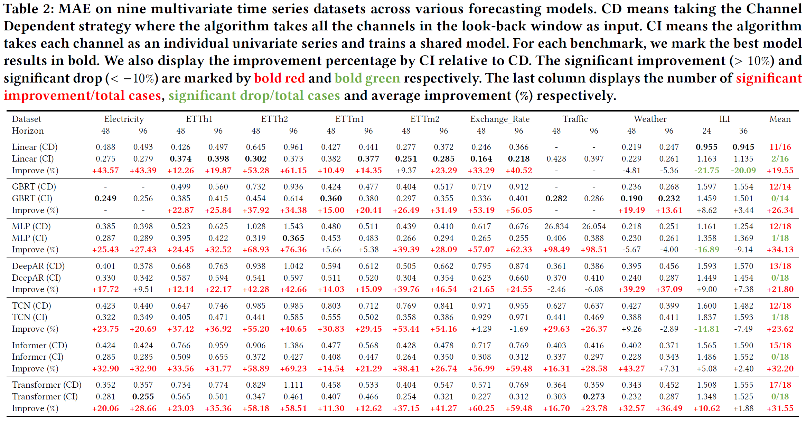

# The Capacity and Robustness Trade-off: Two Strategies for Long-Term Multivariate Time Series Forecasting

Multivariate time series data comprises various channels of variables. The multivariate forecasting models need to capture the relationship between the channels to accurately predict future values. However, recently, there has been an emergence of methods that employ the Channel Independent (CI) strategy. These methods view multivariate time series data as separate univariate time series and disregard the correlation between channels. Surprisingly, our empirical results have shown that models trained with the CI strategy outperform those trained with the Channel Dependent (CD) strategy, usually by a significant margin. Nevertheless, the reasons behind this phenomenon have not yet been thoroughly explored in the literature. This paper provides comprehensive empirical and theoretical analyses of the characteristics of multivariate time series datasets and the CI/CD strategy. Our results conclude that the CD approach has higher capacity but often lacks robustness to accurately predict distributionally drifted time series. In contrast, the CI approach trades capacity for robust prediction. Practical measures inspired by these analyses are proposed to address the capacity and robustness dilemma, including a modified CD method called Predict Residuals with Regularization (PRReg) that can surpass the CI strategy. We hope our findings can raise awareness among researchers about the characteristics of multivariate time series and inspire the construction of better forecasting models.

**The Channel Dependent (CD) and Channel Independent (CI) Strategy**:

**Performance comparison**:

## Prerequisites

## Datasets

We refer to [this repository](https://github.com/thuml/Autoformer#get-started) for downloading datasets.

## Scripts

### Results in Table.2 

To reproduce the Channel Dependent (CD) results in Table.2. Run the script files under folder `scripts/performance/channel_dependent`. For example run Transformer (CD) by

> sh scripts/performance/channel_dependent/Transformer.sh

To reproduce the Channel Independent (CI) results in Table.2. Run the script files under folder `scripts/performance/channel_independent`. For example run Transformer (CI) by

> sh scripts/performance/channel_independent/Transformer.sh

### Results of Figure.9

Run the script file under folder `scripts/low_rank`.

> sh scripts/low_rank/Transformer.sh

### Results of PRReg

To reproduce the PRReg results in Table.4. Run the script files under folder `scripts/prreg`. For example run Transformer (PRReg) by

> sh scripts/prreg/Transformer.sh

### Results of Table.5

Run the script files under folder `scripts/loss`:

> sh scripts/loss/Transformer_mae_mse.sh

## Acknowledgement

We appreciate the following github repos a lot for their valuable code base or datasets:

https://github.com/zhouhaoyi/Informer2020

https://github.com/thuml/Autoformer

https://github.com/Daniela-Shereen/GBRT-for-TSF

https://github.com/unit8co/darts

https://github.com/zhouhaoyi/ETDataset

https://github.com/laiguokun/multivariate-time-series-data
